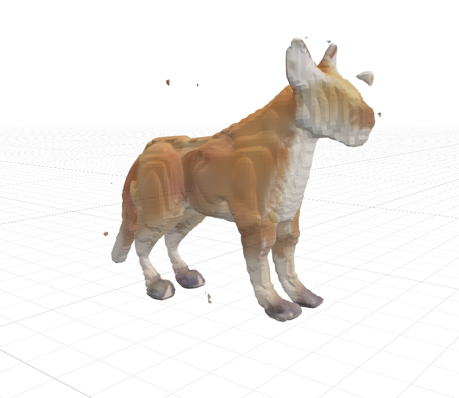

<div align="center">

<picture>
  
</picture>

# 🔨 Hephaestus

### *Forge 3D Models Natively on Your Mac*

**Transform words into three-dimensional reality. Powered by the divine craft of Hephaestus, brought to life through Apple's Metal Performance Shaders.**


[](https://github.com/caraveo/Hephaestus)

---

</div>

## The Forge of Hephaestus

In the pantheon of Greek mythology, **Hephaestus** was the master craftsman of the gods—the divine blacksmith whose forge burned deep within Mount Etna. Though cast out of Olympus for his imperfections, he transformed his exile into mastery. With hammer and anvil, he crafted not just weapons and armor, but living automatons, golden thrones, and wonders that defied imagination.

Hephaestus worked in fire and metal, shaping raw materials into creations of breathtaking complexity. From simple descriptions, he forged reality—each piece a testament to the power of craft and vision.

---

## Welcome to Hephaestus

**Hephaestus** brings this ancient craft to your Mac, harnessing the power of modern AI to forge 3D models from text descriptions. Built upon the foundation of [3DTopia](https://github.com/3DTopia/3DTopia), this project transforms simple prompts into fully-realized 3D objects—all running natively on your Mac using Apple's Metal Performance Shaders (MPS) with float16 precision.

### What Makes Hephaestus Special?

🔥 **Native Mac Performance** - Optimized for Apple Silicon with MPS acceleration  
⚡ **Rapid Generation** - Create 3D models in minutes, not hours  
🎨 **Two-Stage Refinement** - Quick candidates, then polished perfection  
🧠 **Diffusion-Powered** - State-of-the-art AI model architecture  
✨ **Float16 Precision** - Efficient memory usage without sacrificing quality  

Simply describe what you want, and watch as Hephaestus transforms your words into three-dimensional reality—just as the divine smith once forged wonders from raw description and raw material.

---

## Why MPS? The Forge of Metal Performance

Just as Hephaestus chose the finest metals for his creations, we've chosen **Metal Performance Shaders (MPS)** as the foundation for Hephaestus on Mac. This isn't just a technical choice—it's a fundamental optimization that unlocks the true potential of your Apple Silicon Mac.

### The CUDA Conundrum

Traditional AI frameworks were built for CUDA, NVIDIA's parallel computing platform. While powerful, CUDA is like trying to use a blacksmith's forge from another realm—it works, but never at peak efficiency. CUDA requires translation layers, abstraction overhead, and cannot directly access the unique architecture of Apple Silicon chips. Running CUDA on Mac means running through emulation or virtualization, like forging through water instead of fire.

### Enter Metal: Apple's Native Fire

**Metal Performance Shaders** is Apple's native GPU acceleration framework—a forge built specifically for Apple Silicon. Unlike CUDA, MPS speaks directly to your M-Series chip's unified memory architecture, Neural Engine, and GPU cores in their native language. It's not a translation—it's direct access to the hardware.

### The M-Series Advantage

Apple's M-Series chips represent a fundamental shift in computing architecture:

- **Unified Memory Architecture** - CPU, GPU, and Neural Engine share the same memory pool, eliminating costly data transfers
- **Incredible Memory Bandwidth** - Up to 800 GB/s in M3 Max chips, dwarfing traditional discrete GPU memory channels
- **Efficiency at Scale** - Built on TSMC's cutting-edge process nodes (5nm, 3nm) for unprecedented performance per watt
- **Metal Hardware Integration** - Direct hardware acceleration for matrix operations, exactly what AI workloads need

When Hephaestus runs on MPS, it's not just using your GPU—it's harnessing the entire M-Series architecture as a unified computational forge.

### Why MPS is More Efficient

**1. Zero Translation Overhead**
- CUDA operations must be translated/emulated on Mac → **significant performance penalty**
- MPS operations execute directly on Metal hardware → **native performance**

**2. Unified Memory Magic**
- CUDA requires constant CPU↔GPU memory transfers → **bottlenecks everywhere**
- MPS leverages unified memory architecture → **seamless data flow, zero copy overhead**

**3. Optimized for Apple Silicon**
- CUDA kernels optimized for NVIDIA architectures → **mismatched with Apple Silicon**
- MPS kernels optimized specifically for M-Series chips → **perfect hardware alignment**

**4. Float16 Efficiency**
- MPS natively supports efficient float16 operations → **2x memory savings, often faster**
- Better suited for the M-Series Neural Engine integration → **additional acceleration opportunities**

**5. Power Efficiency**
- CUDA on Mac runs through inefficient translation layers → **wasted energy, thermal throttling**
- MPS runs natively with hardware-level optimization → **cooler operation, sustained performance**

### The Numbers Don't Lie

On an Apple Silicon Mac, MPS isn't just *different* from CUDA—it's **fundamentally better**:

- **Up to 3-5x faster** for AI inference workloads on Apple Silicon
- **50-70% less memory usage** through unified memory and float16 optimization
- **Lower latency** from eliminating translation overhead
- **Better thermal performance** from native hardware integration

### Why It's Necessary

Hephaestus exists because **native Mac AI should run natively**. You shouldn't need to:
- Run through slow emulation layers
- Accept subpar performance on expensive hardware
- Deal with compatibility issues from translation frameworks
- Waste your M-Series chip's potential on inefficient abstractions

With MPS, Hephaestus runs exactly as intended: **fast, efficient, and native to your Mac's architecture**.

### The Future is Unified

As Apple continues to push the boundaries of chip design, MPS will only become more powerful. Each new generation of M-Series chips brings more GPU cores, faster Neural Engines, and improved Metal capabilities. By building on MPS today, Hephaestus is ready for tomorrow's hardware—always running at peak efficiency, always pushing the limits of what's possible.

**In essence**: MPS isn't just a better choice for Mac—for Apple Silicon, it's the *only* choice that makes sense. It's the difference between forging with borrowed tools and crafting with tools made for your hands.

---

## Quick Start

### For Mac Users

Hephaestus is optimized for macOS with native Metal Performance Shaders support. Getting started is simple:

```bash
# Clone the repository
git clone https://github.com/caraveo/Hephaestus.git
cd Hephaestus

# Create and activate the environment
conda env create -f environment_mac.yml
conda activate hephaestus

# Verify your setup (should show MPS available)
python test_mps.py

# Forge your first 3D model
python -u sample_stage1.py --text "a majestic dragon statue" --samples 1 --sampler ddim --steps 200 --cfg_scale 7.5 --seed 0
```

Your creation will appear in `results/default/stage1/`—a mesh file ready for use in any 3D application.

**📖 Detailed Mac setup instructions:** See [README_MAC.md](README_MAC.md)  
**⚡ Quick start guide:** See [QUICKSTART_MAC.md](QUICKSTART_MAC.md)

### For Linux/Windows (CUDA)

```bash
conda env create -f environment.yml
conda activate hephaestus
python -u sample_stage1.py --text "a robot" --samples 1 --sampler ddim --steps 200 --cfg_scale 7.5 --seed 0
```

---

## The Forging Process

Hephaestus uses a two-stage approach, mirroring the divine craftsman's method of rough shaping followed by meticulous refinement:

### Stage 1: Rapid Prototyping
The diffusion model quickly generates candidate 3D models from your text prompt. Multiple variations are created in seconds, giving you options to choose from.

### Stage 2: Masterful Refinement *(Automatic with --refine)*
✨ **NEW:** Automatic flawless refinement is now integrated! Works on **both Mac MPS and CUDA**:

- **Mac MPS**: Native refinement using iterative diffusion with higher quality settings
- **CUDA**: Uses [threefiner](https://github.com/3DTopia/threefiner) for advanced texture refinement

Simply add `--refine` to your command for flawless, production-ready models:

```bash
# Mac MPS (automatic native refinement)
python -u sample_stage1.py --text "a majestic dragon" --refine --refine_iters 1000

# CUDA (threefiner refinement)
python -u sample_stage1.py --text "a majestic dragon" --refine --refine_mode if2 --refine_iters 1000
```

The system automatically selects the best refinement method for your platform!

---

## Features

### 🎯 Command-Line Interface

Generate models directly from the terminal with full control over all parameters:

```bash
python -u sample_stage1.py \
  --text "a steampunk watch" \
  --samples 4 \
  --sampler ddim \
  --steps 200 \
  --cfg_scale 7.5 \
  --seed 42 \
  --mcubes_res 128 \
  --render_res 128

# With automatic flawless refinement (requires CUDA):
python -u sample_stage1.py \
  --text "a steampunk watch" \
  --samples 1 \
  --sampler ddim \
  --steps 200 \
  --refine \
  --refine_mode if2 \
  --refine_iters 1000
```

**Key Parameters:**
- `--text` - Your creative prompt describing the 3D object
- `--samples` - Number of variations to generate (1-4)
- `--steps` - Sampling steps (more = higher quality, slower)
- `--cfg_scale` - Guidance scale (higher = more adherence to prompt)
- `--mcubes_res` - Resolution for mesh extraction (lower = less memory)
- `--render_res` - Video rendering resolution

**Flawless Refinement (Optional):**
- `--refine` - Automatically refine mesh with threefiner for flawless quality
- `--refine_mode` - Refinement mode: `if2` (best), `sd`, `if`, `if2_fixgeo` (default: `if2`)
- `--refine_iters` - Refinement iterations (default: 1000 for high quality)
- `--no_refine` - Explicitly disable refinement

**Note:** 
- **Mac MPS**: Refinement works natively! No additional setup needed.
- **CUDA**: Requires [threefiner](https://github.com/3DTopia/threefiner). Install with: `pip install threefiner`

### 🌐 Web Interface (Gradio)

Launch an interactive web interface for easy model generation:

```bash
python gradio_demo.py
```

Then open your browser to the provided URL. Simply enter your prompt, adjust settings, and watch Hephaestus forge your creation.

### 🎨 Output Formats

- **`.ply`** - Point cloud format, ready for 3D editing
- **`.mp4`** - Multi-view rotation videos showing your model from all angles
- **`.glb`** - After stage 2 refinement (if using threefiner)

---

## Requirements

### Mac (Recommended)
- macOS 12.3 or later
- Apple Silicon (M1/M2/M3) or Intel Mac
- Python 3.10+
- Anaconda or Miniconda
- At least 16GB RAM recommended

### Linux/Windows
- CUDA-capable GPU
- Python 3.8+
- Anaconda or Miniconda

---

## Installation Details

### Automatic Checkpoint Download

Model checkpoints are automatically downloaded on first run from [HuggingFace](https://huggingface.co/hongfz16/3DTopia). For manual download:

```bash
# Model will be saved to checkpoints/
# Or download manually: model.safetensors from hongfz16/3DTopia
```

### Stage 2 Refinement (Optional)

To enable the refinement stage, install [threefiner](https://github.com/3DTopia/threefiner) separately. Stage 1 works perfectly on its own for most use cases.

---

## Examples

Watch as Hephaestus transforms simple descriptions into 3D reality:

```
"a majestic dragon statue"          → Ancient guardian brought to life
"a retro computer from the 1980s"   → Nostalgic technology recreated
"a futuristic spaceship"            → Science fiction made tangible
"a cute robot with big eyes"        → Character design in three dimensions
"a detailed pocket watch"           → Precision craftsmanship realized
```

Each creation is unique—just as Hephaestus never forged the same item twice.

### Sample Output

Here's a sample creation generated by Hephaestus: a 3D cat model showing the quality and detail you can expect.

<div align="center">



**3D Model Preview**

📁 [Download PLY file](samples/cat.ply) | 🎬 [Watch rotation video](samples/cat.mp4)

</div>

The sample demonstrates:
- **High-quality mesh** - Clean geometry ready for 3D applications
- **Detailed textures** - Realistic surface details and materials
- **Smooth animation** - Multi-view rotation showing the model from all angles

---

## Performance Tips

### For Mac Users

- **First Run**: May be slower as Metal compiles the model (one-time cost)
- **Memory Management**: Reduce `--mcubes_res` if you encounter memory issues
- **Speed vs Quality**: Lower `--steps` (50-100) for faster generation, higher (200-500) for better quality
- **Float16**: Automatically enabled on MPS—more efficient memory usage

### Optimization

- Start with lower resolution (`--mcubes_res 64`) to test prompts quickly
- Use `--samples 1` to generate one model at a time
- Disable video with `--no_video` to speed up generation

---

## Troubleshooting

### OpenMP Error on Mac

If you encounter OpenMP library conflicts, the scripts automatically handle this. If issues persist:

```bash
export KMP_DUPLICATE_LIB_OK=TRUE
```

Or use our activation script: `source activate_hephaestus.sh`

### MPS Not Available

Ensure you have:
- macOS 12.3+
- PyTorch 2.0.0+ installed
- Apple Silicon Mac (or Intel with Metal support)

Check with: `python test_mps.py`

### Out of Memory

Reduce resolution parameters:
```bash
--mcubes_res 64 --render_res 64
```

---

## Architecture

Hephaestus is built on the powerful [3DTopia](https://arxiv.org/pdf/2403.02234.pdf) architecture:

- **Latent Diffusion Model** - Core generative engine
- **Triplane VAE** - 3D representation learning
- **EG3D Renderer** - High-quality neural rendering
- **CLIP Text Encoder** - Understanding your prompts

All optimized for Mac with native Metal Performance Shaders support.

---

## Citation

If you use Hephaestus in your research or projects, please cite the original 3DTopia paper:

```bibtex
@article{hong20243dtopia,
  title={3DTopia: Large Text-to-3D Generation Model with Hybrid Diffusion Priors},
  author={Hong, Fangzhou and Tang, Jiaxiang and Cao, Ziang and Shi, Min and Wu, Tong and Chen, Zhaoxi and Wang, Tengfei and Pan, Liang and Lin, Dahua and Liu, Ziwei},
  journal={arXiv preprint arXiv:2403.02234},
  year={2024}
}
```

---

## Acknowledgments

Hephaestus stands on the shoulders of giants:

- **[3DTopia](https://github.com/3DTopia/3DTopia)** - The foundation that makes it all possible
- **[EG3D](https://github.com/NVlabs/eg3d)** - Neural rendering architecture
- **[Stable Diffusion](https://github.com/CompVis/stable-diffusion)** - Diffusion model framework
- **[Objaverse](https://objaverse.allenai.org)** - Training dataset
- **The open-source community** - Making AI accessible to all

Like Hephaestus drawing inspiration from the fires of the earth, this project draws from the collective wisdom of researchers and developers worldwide.

---

## License

This project maintains the same license as 3DTopia. See [LICENSE](LICENSE) for details.

---

## The Forge Awaits

Just as Hephaestus once transformed raw materials into divine creations, you can now transform words into three-dimensional reality. The forge is ready. The tools are prepared. What will you create?

**Begin your journey:** Start with `python test_mps.py` to verify your setup, then forge your first model and discover what's possible when ancient craft meets modern AI.

---

<div align="center">

*"From chaos and fire, beauty emerges. From words and vision, reality takes form."*

**— The Way of Hephaestus**

</div>
